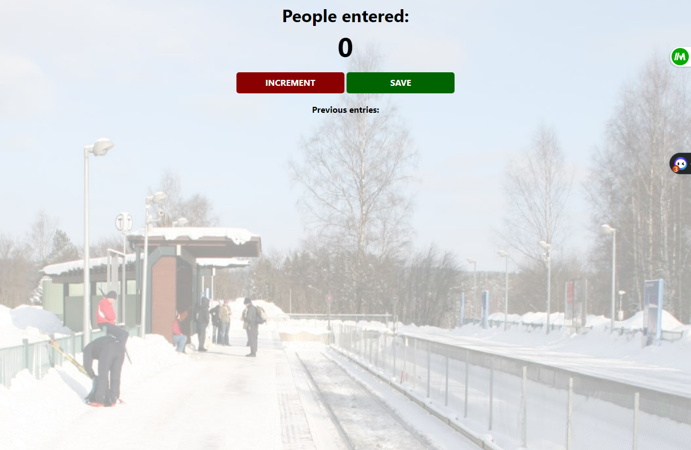

# JavaScript Subway Passenger Counter - Project README



This repository contains a simple JavaScript website that allows you to count the number of passengers entering the subway and save that number for display on the screen. The project utilizes basic DOM manipulation to update the user interface dynamically.

## Table of Contents

- [Introduction](#introduction)
- [Demo](#demo)
- [Installation](#installation)
- [Usage](#usage)
- [Technologies Used](#technologies-used)
- [Contributing](#contributing)
- [License](#license)

## Introduction

Have you ever wanted a quick and easy way to count the number of passengers entering the subway? Look no further! This JavaScript Subway Passenger Counter provides a simple interface with two buttons—one for counting the passengers and another for displaying the count on the screen.

## Demo

Check out the live demo of the project at [https://your-demo-url.com](https://your-demo-url.com) (Replace this with your actual demo URL).

## Installation

To run this project locally, follow these steps:

1. Clone this repository to your local machine using the following command:

```
git clone <repository_url>
```

2. Navigate to the project directory:

```
cd javascript-subway-passenger-counter
```

## Usage

To use the Subway Passenger Counter, open the `index.html` file in your web browser. You will see two buttons on the screen:

1. **Count Passenger**: Click on this button each time a new passenger enters the subway. The passenger count will increase by one with each click.

2. **Save & Display**: This button saves the current passenger count and displays it on the screen. Once you click this button, the count will be visible on the top of the page.

Feel free to use this simple passenger counter to keep track of subway riders or adapt it for other counting purposes as needed!

## Technologies Used

The project uses the following technologies:

- HTML5
- CSS3
- JavaScript

## Contributing

Contributions are welcome! If you find any issues or want to enhance the project, feel free to create a pull request. Before contributing, please review the [Contribution Guidelines](CONTRIBUTING.md).

## License

This project is open-source and available under the [MIT License](LICENSE).

---

Thank you for checking out this project! If you have any questions or feedback, please feel free to create an issue or contact the project maintainers. Happy counting!
